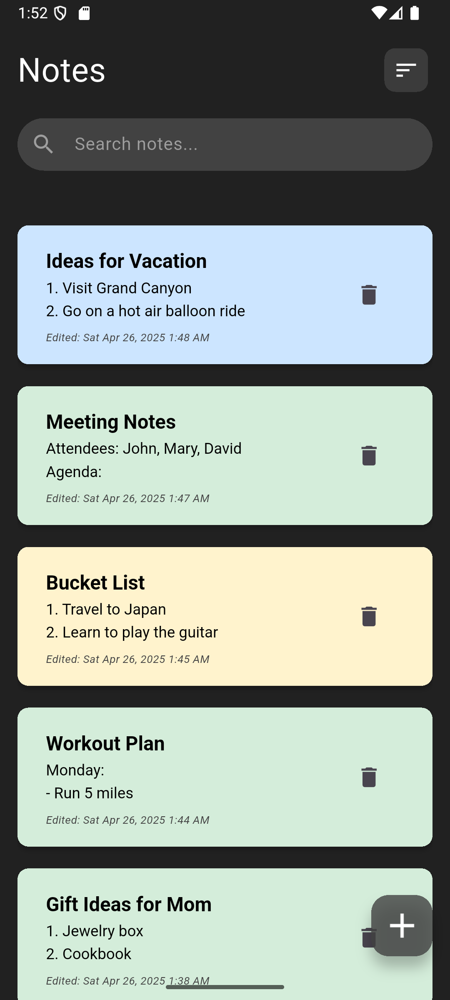
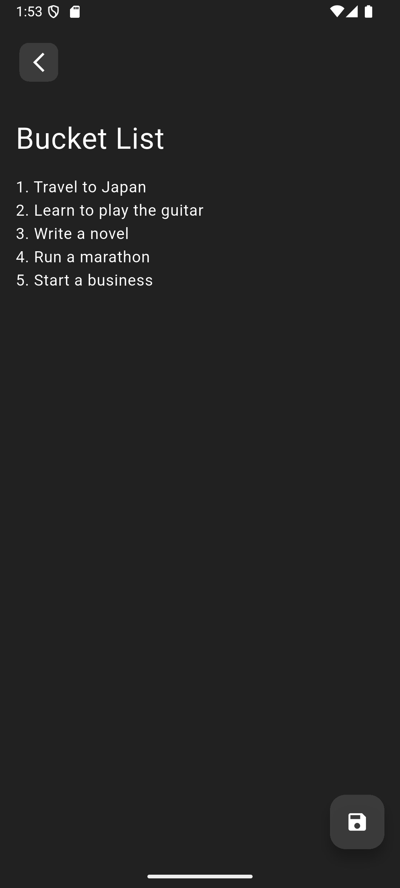
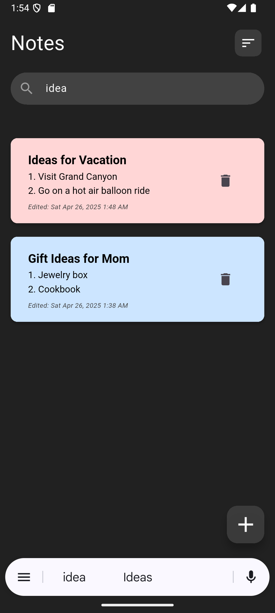

<h1 align="center">📒 Notes – Notepad, Notebook</h1>

  A simple, clean, and privacy-friendly notes app for capturing your ideas anytime, anywhere.

---

## 📜 Overview

**Notes – Notepad, Notebook** is a lightweight and easy-to-use note-taking app designed to help you quickly jot down thoughts, organize lists, and manage ideas without distractions.  
No logins, no unnecessary permissions — just you and your notes.

---

## ✨ Features

- 🖊 **Create, edit, and delete notes** with a clean, minimal interface  
- 📂 **Organize effortlessly** — keep your thoughts structured  
- 🚀 **Lightweight & fast** — optimized for quick use  
- 🔒 **Privacy-first** — no data collection or third-party sharing  

---

## 📸 Screenshots

  
  
  

---

## 📥 Installation

### **Android**
Get the app from Google Play:  

### **Windows / macOS (via Emulator)**
Use Android emulators like **BlueStacks** or **NoxPlayer** to run the APK on your desktop.

---

